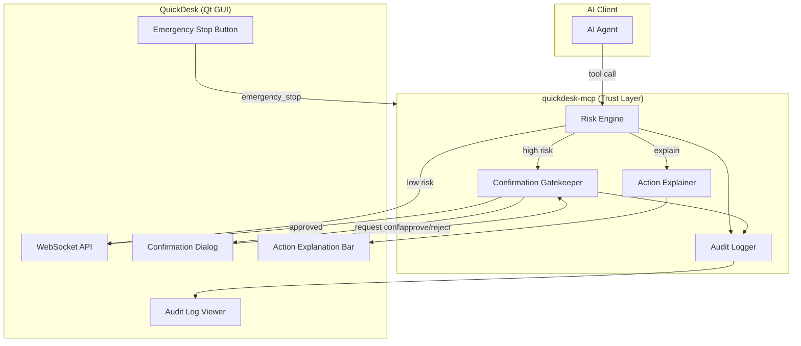
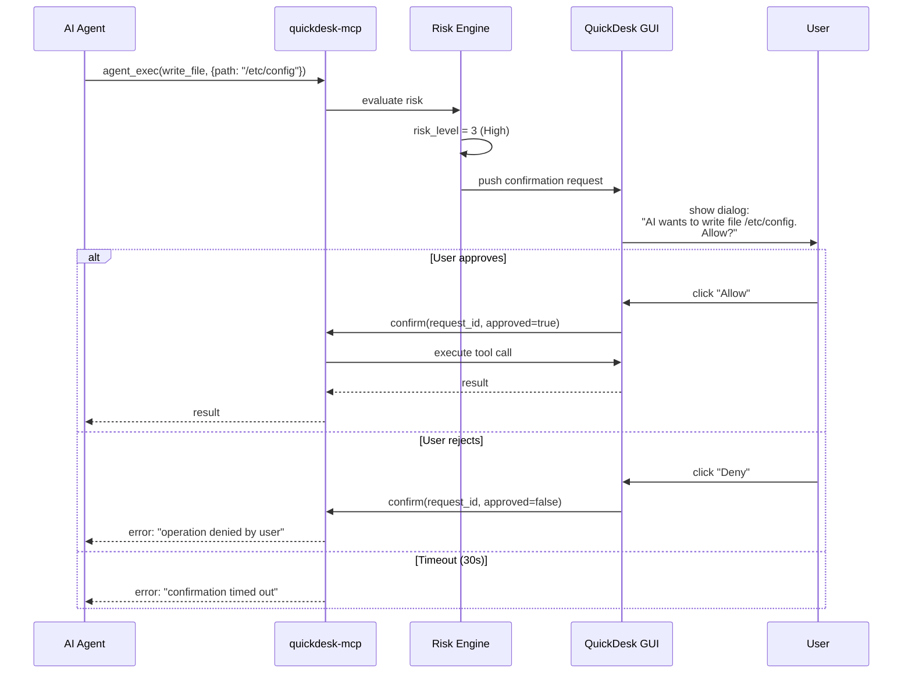
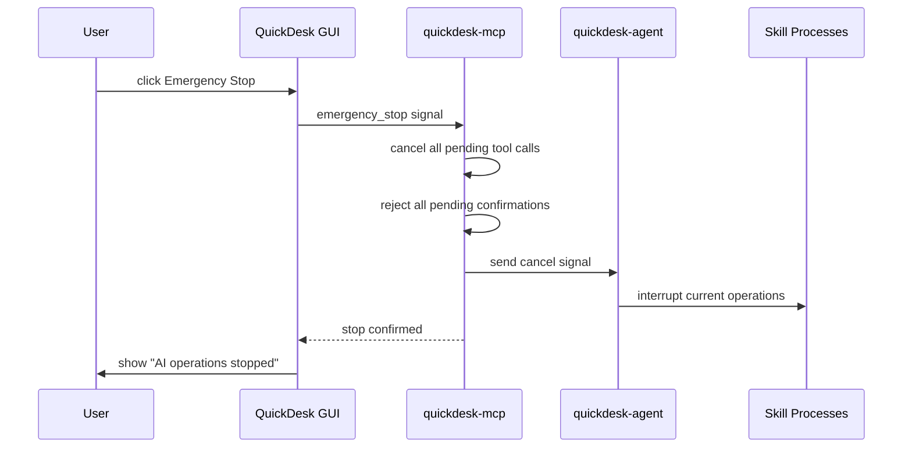

# 人机协同与信任层技术方案

## 1. 背景与目标

### 1.1 核心问题

AI 操控电脑是强能力，但也天然让人不安。如果用户不敢打开 AI、不敢演示给别人看、不敢在生产环境使用，那么再强的能力也无法产生价值。

当前 QuickDesk 的 AI 操作对用户来说是一个"黑盒"：

1. **不知道下一步要做什么**：AI 突然点击某个位置，用户不知道为什么
2. **无法阻止危险操作**：删文件、关机等操作没有确认环节
3. **出问题后无法回溯**：不知道 AI 做了什么导致了问题

### 1.2 目标

- **操作透明**：用户实时知道 AI 在做什么、为什么这么做
- **风险可控**：危险操作必须经过用户确认
- **随时可停**：一键急停，立即终止 AI 操作
- **事后可查**：完整的操作审计链

### 1.3 验收标准

- 用户可实时理解 AI 下一步要做什么
- 高风险动作均有强制确认链路
- 急停响应时间 < 500ms
- 所有确认/拒绝/急停记录完整可查

---

## 2. 整体架构



### 2.1 关键设计决策

| 决策 | 选择 | 理由 |
|------|------|------|
| 信任层位置 | quickdesk-mcp 拦截层 | 所有 tool calls 必经之路，AI 无法绕过 |
| 风险评估 | 基于规则的静态分析 | 可预测、可调试、无额外模型开销 |
| 确认 UI | QuickDesk Qt 桌面弹窗 | 用户一定在本地，弹窗最直接 |
| 急停机制 | 取消所有 pending requests + 通知 agent | 简单可靠 |

---

## 3. 详细设计

### 3.1 风险分级模型

#### 风险等级

| 等级 | 名称 | 行为 | 示例 |
|------|------|------|------|
| 0 | **Safe** | 直接执行 | `screenshot`, `get_ui_state`, `get_screen_text` |
| 1 | **Low** | 执行 + 记录 | `mouseClick`, `keyboardType` (普通文本) |
| 2 | **Medium** | 执行 + 通知用户 | `agent_exec(run_command)`, `keyboardHotkey` |
| 3 | **High** | 需要用户确认 | `agent_exec(write_file)`, 包含危险关键词的命令 |
| 4 | **Critical** | 强制确认 + 二次验证 | 删除文件、系统关机、格式化等 |

#### 风险规则

```json
{
  "rules": [
    {
      "pattern": "screenshot|get_ui_state|get_screen_text|find_element|list_connections",
      "risk_level": 0
    },
    {
      "pattern": "mouseClick|mouseMove|scroll|keyboardType",
      "risk_level": 1,
      "elevate_when": {
        "keyboardType.text_contains": ["shutdown", "reboot", "rm -rf", "del /f", "format"]
      }
    },
    {
      "pattern": "keyboardHotkey",
      "risk_level": 2,
      "elevate_when": {
        "keys_match": ["Alt+F4", "Ctrl+Alt+Delete"]
      }
    },
    {
      "pattern": "agent_exec",
      "risk_level": 2,
      "sub_rules": [
        { "tool_name": "read_file|list_directory|get_system_info|list_processes|get_file_info", "risk_level": 1 },
        { "tool_name": "write_file|create_directory|move_file", "risk_level": 3 },
        { "tool_name": "run_command", "risk_level": 2,
          "elevate_when": {
            "command_contains": ["rm ", "del ", "shutdown", "reboot", "format", "mkfs", "fdisk", "DROP TABLE"]
          }
        }
      ]
    }
  ]
}
```

### 3.2 确认流程



#### 确认对话框设计

```
┌──────────────────────────────────────┐
│  ⚠ AI Action Requires Confirmation  │
├──────────────────────────────────────┤
│                                      │
│  Action: Write file                  │
│  Path: /etc/nginx/nginx.conf         │
│  Content: (preview first 200 chars)  │
│                                      │
│  Risk Level: ██░░░ High              │
│                                      │
│  [Always Allow]  [Allow]  [Deny]     │
│                                      │
└──────────────────────────────────────┘
```

按钮说明：
- **Always Allow**：将此操作模式添加到白名单
- **Allow**：仅本次允许
- **Deny**：拒绝执行

### 3.3 操作解释

每个 tool call 执行前，生成 human-readable 的操作描述，显示在 QuickDesk UI 中：

| Tool | 解释模板 |
|------|---------|
| `mouseClick(x=500, y=300)` | "Clicking at screen position (500, 300)" |
| `keyboardType("hello")` | "Typing text: hello" |
| `keyboardHotkey(["Ctrl", "S"])` | "Pressing hotkey: Ctrl+S" |
| `agent_exec(run_command, "ls -la")` | "Running command: ls -la" |
| `agent_exec(write_file, "/etc/config")` | "Writing file: /etc/config" |
| `screenshot()` | "Taking screenshot" |

**UI 展示**：QuickDesk 底部状态栏实时显示当前 AI 操作，类似浏览器状态栏。

### 3.4 急停机制

#### 触发方式

1. **GUI 按钮**：QuickDesk 主窗口/远程窗口的急停按钮
2. **快捷键**：可配置全局热键（默认 `Ctrl+Shift+Escape`）
3. **MCP 工具**：AI 自身调用 `emergency_stop`（用于 AI 发现异常时自我停止）

#### 急停流程



**急停效果**：

1. 立即取消所有排队中的 tool calls
2. 中断正在执行的操作（发送 cancel 给 agent）
3. 拒绝后续 tool calls 直到用户恢复
4. 在 audit log 中记录急停事件

### 3.5 信任策略配置

用户可配置的策略参数：

```json
{
  "trust_policy": {
    "auto_approve_level": 1,
    "confirmation_timeout_sec": 30,
    "whitelist": [
      "screenshot",
      "get_ui_state",
      "mouseClick"
    ],
    "blacklist": [
      "keyboardHotkey:Alt+F4"
    ],
    "auto_approve_patterns": [
      { "tool": "agent_exec.read_file", "path_prefix": "/var/log/" }
    ],
    "session_trust_escalation": false,
    "require_2fa_for_critical": false
  }
}
```

| 参数 | 说明 | 默认值 |
|------|------|--------|
| `auto_approve_level` | 自动批准的最高风险等级 | 1 (Low) |
| `confirmation_timeout_sec` | 确认超时秒数 | 30 |
| `whitelist` | 始终允许的工具 | 所有 Safe 级别工具 |
| `blacklist` | 始终拦截的操作 | 系统关键操作 |
| `session_trust_escalation` | 允许会话内信任升级 | false |

### 3.6 审计日志

#### 日志格式

```json
{
  "timestamp": "2026-03-18T10:30:15.123Z",
  "session_id": "sess_001",
  "device_id": "123456789",
  "event_type": "confirmation_request",
  "tool": "agent_exec",
  "arguments": { "tool_name": "write_file", "path": "/etc/config" },
  "risk_level": 3,
  "user_action": "approved",
  "response_time_ms": 2500,
  "explanation": "Writing file: /etc/config"
}
```

#### 事件类型

| 类型 | 说明 |
|------|------|
| `auto_approved` | 低风险，自动批准 |
| `confirmation_request` | 发送确认请求 |
| `user_approved` | 用户批准 |
| `user_denied` | 用户拒绝 |
| `confirmation_timeout` | 确认超时 |
| `emergency_stop` | 急停 |
| `whitelist_hit` | 命中白名单 |
| `blacklist_hit` | 命中黑名单 |

---

## 4. 新增 MCP 工具

| Tool | 描述 | 参数 |
|------|------|------|
| `request_confirmation` | 请求用户确认（由 AI 主动调用） | `action_description`, `risk_level` |
| `explain_action` | 提供操作解释文本 | `explanation` |
| `emergency_stop` | 急停所有 AI 操作 | `reason` (optional) |
| `get_trust_policy` | 获取当前信任策略 | 无 |
| `set_trust_policy` | 更新信任策略 | `policy` (partial update) |
| `get_audit_log` | 查询审计日志 | `session_id`, `time_range`, `event_type` |

---

## 5. Qt GUI 变更

### 5.1 急停按钮

- **位置**：远程桌面窗口浮动工具栏 + 主窗口状态栏
- **样式**：红色醒目图标，hover 时放大
- **快捷键**：`Ctrl+Shift+Escape`（可配置）

### 5.2 操作解释栏

- **位置**：远程桌面窗口底部
- **内容**：当前 AI 操作的描述文本
- **行为**：操作执行时显示，2 秒后淡出

### 5.3 确认弹窗

- **触发**：收到 High/Critical 风险操作时弹出
- **模态**：是（阻止其他操作直到响应）
- **超时**：30 秒后自动拒绝
- **选项**：Always Allow / Allow / Deny

### 5.4 审计日志查看器

- **位置**：设置页面新增 "Audit Log" 区域
- **功能**：按时间倒序显示操作日志，支持按类型筛选

---

## 6. 通信协议

### 6.1 确认请求（MCP → Qt）

通过 WebSocket 推送给 QuickDesk：

```json
{
  "type": "confirmationRequest",
  "request_id": "cr_001",
  "tool": "agent_exec",
  "arguments": { "tool_name": "write_file", "path": "/etc/config" },
  "risk_level": 3,
  "explanation": "Writing file: /etc/config",
  "timeout_sec": 30
}
```

### 6.2 确认响应（Qt → MCP）

```json
{
  "type": "confirmationResponse",
  "request_id": "cr_001",
  "approved": true,
  "always_allow": false
}
```

### 6.3 急停信号（Qt → MCP）

```json
{
  "type": "emergencyStop",
  "reason": "user initiated"
}
```

---

## 7. 实现计划

### 阶段一：风险引擎 + 审计日志（4 天）

| 天 | 任务 |
|----|------|
| 1 | 风险规则引擎设计 + 规则配置文件格式 |
| 2 | Tool call 风险评估拦截层实现 |
| 3 | 审计日志记录 + 存储 |
| 4 | `get_trust_policy` / `set_trust_policy` / `get_audit_log` |

### 阶段二：确认链路（4 天）

| 天 | 任务 |
|----|------|
| 1 | MCP → Qt 确认请求推送 |
| 2 | Qt 确认弹窗 UI 实现 |
| 3 | 确认结果回传 + 超时处理 |
| 4 | 白名单/黑名单 + "Always Allow" |

### 阶段三：急停 + 操作解释（4 天）

| 天 | 任务 |
|----|------|
| 1 | 急停按钮 + 快捷键 + 急停信号处理 |
| 2 | 急停后的状态恢复（resume 机制） |
| 3 | 操作解释栏 UI + 解释文本生成 |
| 4 | 端到端测试 + 文档 |

---

## 8. 风险与缓解

| 风险 | 等级 | 缓解措施 |
|------|------|---------|
| 确认弹窗过于频繁影响体验 | 高 | 提供 "Always Allow" + 可调 auto_approve_level |
| 急停无法中断已发送的操作 | 中 | 急停发送 cancel 信号给 agent，agent 终止子进程 |
| 风险规则误判 | 中 | 规则可配置，用户可调整白名单/黑名单 |
| 操作解释不准确 | 低 | 基于模板生成，不依赖 AI，可预测 |
| 多 AI 客户端并发确认 | 低 | 确认请求队列化，按时间顺序处理 |
