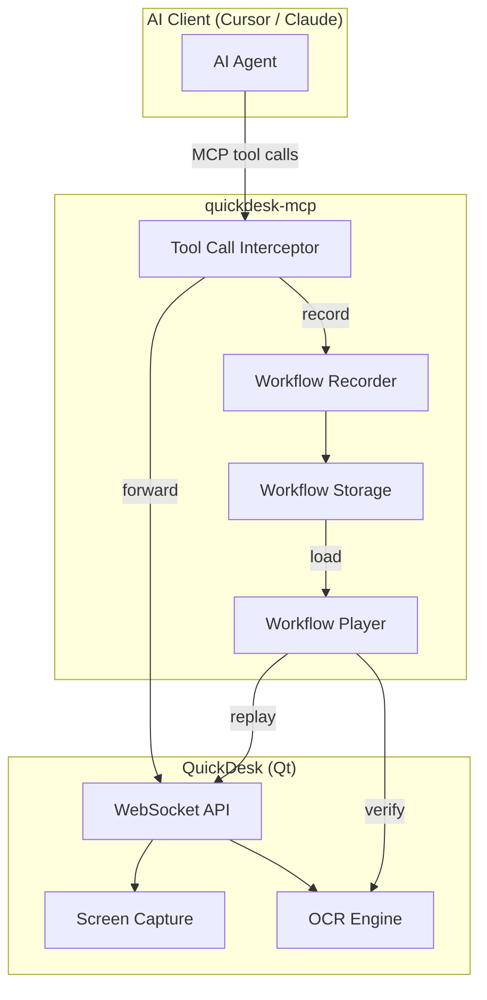
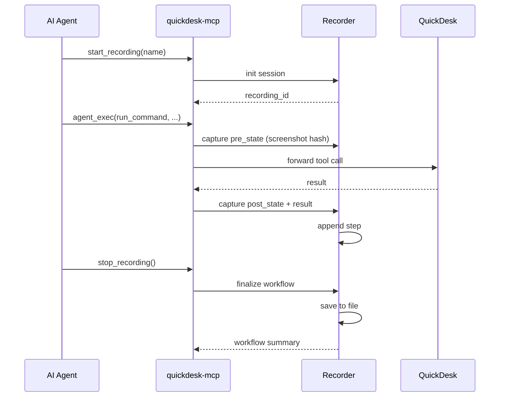
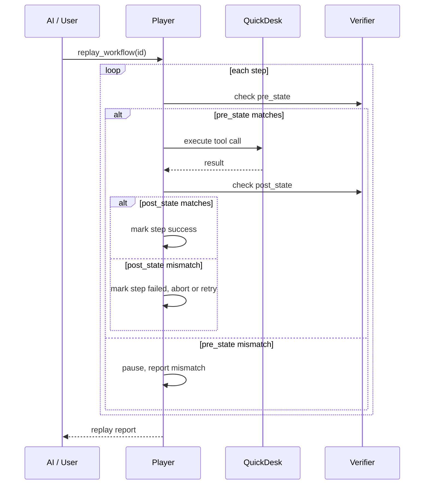

# 工作流录制与回放技术方案

## 1. 背景与目标

### 1.1 要解决的问题

1. **重复任务效率低**：AI 每次执行同类任务都需要从零规划，浪费时间和 token
2. **AI 每次都重新规划**：缺乏历史执行路径的复用能力
3. **演示和复盘材料难沉淀**：成功的操作流程无法被保存和分享

### 1.2 目标

- 可录制：透明记录 AI 操作的完整流程
- 可回放：严格按步骤重放，每步校验
- 可复盘：执行前后状态对比，生成执行报告
- 可分享：工作流文件可在不同设备/用户间传递

### 1.3 验收标准

- 重复任务第二次执行成功率显著高于第一次
- 录制零侵入：不影响正常 AI 操作流程
- 回放失败时提供明确的失败原因和上下文

---

## 2. 整体架构



### 2.1 关键设计决策

| 决策 | 选择 | 理由 |
|------|------|------|
| 录制层位置 | quickdesk-mcp 内拦截 | 能捕获所有 MCP tool calls，无需修改 AI 客户端 |
| 存储格式 | JSON 文件 | 便于查看、编辑、版本控制和跨平台传递 |
| 回放模式 | 逐步执行 + 状态校验 | 兼顾可靠性和灵活性 |
| 状态校验 | OCR + 屏幕 hash | 利用现有 OCR 能力，不引入新依赖 |

---

## 3. 详细设计

### 3.1 工作流存储格式

```json
{
  "id": "wf_20260318_001",
  "name": "Deploy Config Update",
  "description": "Update nginx config and restart service",
  "created_at": "2026-03-18T10:30:00Z",
  "device_profile": {
    "os": "Windows 10",
    "resolution": "1920x1080"
  },
  "variables": {
    "config_path": "/etc/nginx/nginx.conf",
    "service_name": "nginx"
  },
  "steps": [
    {
      "index": 0,
      "tool": "agent_exec",
      "arguments": {
        "tool_name": "read_file",
        "arguments": { "path": "{{config_path}}" }
      },
      "pre_state": {
        "screen_hash": "abc123",
        "ocr_keywords": ["desktop", "terminal"]
      },
      "post_state": {
        "screen_hash": "def456",
        "expected_result_contains": "server {"
      },
      "result": { "content": "server { ... }" },
      "success": true,
      "duration_ms": 1200,
      "retries": 0
    }
  ],
  "total_duration_ms": 45000,
  "success": true
}
```

### 3.2 录制流程



**录制内容**：

| 字段 | 来源 | 说明 |
|------|------|------|
| `tool` | MCP 拦截 | 工具名称 |
| `arguments` | MCP 拦截 | 工具参数 |
| `pre_state.screen_hash` | 录制前截图 hash | 校验回放起始状态 |
| `pre_state.ocr_keywords` | OCR 提取 | 关键文本 |
| `post_state.screen_hash` | 执行后截图 hash | 校验执行结果 |
| `result` | 工具返回值 | 用于结果对比 |
| `success` | 执行结果 | 是否成功 |
| `duration_ms` | 计时 | 执行耗时 |
| `retries` | 重试记录 | 失败重试次数 |

### 3.3 回放流程

#### 阶段一：严格回放



#### 阶段二：智能回放（后续）

当 pre_state 不匹配时：

1. 使用 `find_element` 查找预期 UI 元素
2. 如果找到但位置不同，自动调整坐标
3. 如果完全找不到，暂停并请求 AI 介入
4. AI 提供替代方案后继续

### 3.4 参数化

工作流支持变量替换（`{{variable}}` 语法）：

- 录制时自动识别路径、设备名等可变内容
- 回放前可指定变量值
- 支持从设备画像自动填充变量

### 3.5 复盘报告

每次回放生成执行报告：

```json
{
  "workflow_id": "wf_001",
  "replay_id": "rp_001",
  "started_at": "2026-03-18T11:00:00Z",
  "completed_at": "2026-03-18T11:01:30Z",
  "total_steps": 10,
  "succeeded_steps": 9,
  "failed_steps": 1,
  "skipped_steps": 0,
  "failure_details": [
    {
      "step_index": 7,
      "reason": "post_state mismatch",
      "expected_keywords": ["Success"],
      "actual_keywords": ["Error", "timeout"]
    }
  ]
}
```

---

## 4. 新增 MCP 工具

| Tool | 描述 | 参数 |
|------|------|------|
| `start_recording` | 开始录制工作流 | `name`, `description` (optional) |
| `stop_recording` | 停止录制并保存 | 无 |
| `list_workflows` | 列出所有工作流 | `page`, `limit` (optional) |
| `get_workflow` | 获取工作流详情 | `workflow_id` |
| `replay_workflow` | 回放工作流 | `workflow_id`, `variables` (optional), `stop_on_failure` (optional) |
| `delete_workflow` | 删除工作流 | `workflow_id` |

---

## 5. 实现计划

### 阶段一：录制（8 天）

| 天 | 任务 |
|----|------|
| 1-2 | 工作流存储格式定义 + JSON 文件读写 |
| 3-4 | MCP 拦截层：捕获 tool calls + pre/post state |
| 5-6 | `start_recording` / `stop_recording` 工具实现 |
| 7-8 | 测试 + 修复 |

### 阶段二：回放（8 天）

| 天 | 任务 |
|----|------|
| 1-2 | Player 核心：逐步执行 + 状态校验 |
| 3-4 | `replay_workflow` 工具实现 |
| 5-6 | 变量替换 + 回放报告生成 |
| 7-8 | `list_workflows` / `get_workflow` / `delete_workflow` |

### 阶段三：智能回放（8 天）

| 天 | 任务 |
|----|------|
| 1-3 | 状态不匹配时的 `find_element` 自动适配 |
| 4-6 | AI 介入接口：暂停回放、请求 AI 决策、继续 |
| 7-8 | 端到端测试 + 文档 |

---

## 6. 存储与文件管理

- 默认存储路径：`~/.quickdesk/workflows/`
- 文件命名：`{workflow_id}.json`
- 可通过设置界面配置存储路径
- 工作流文件可直接复制分享

---

## 7. 风险与缓解

| 风险 | 等级 | 缓解措施 |
|------|------|---------|
| 屏幕状态变化导致回放失败 | 高 | 结合 OCR 关键词校验而非精确 hash 对比 |
| 录制文件过大（截图） | 中 | 只存储 hash 和关键词，不存储完整截图 |
| 跨分辨率回放失败 | 中 | 使用相对坐标 + `find_element` 自动适配 |
| 工作流格式变化兼容性 | 低 | 文件包含 format_version 字段，支持迁移 |
