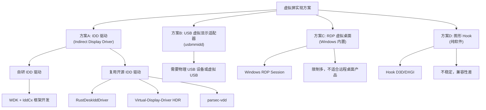
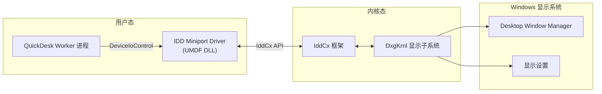
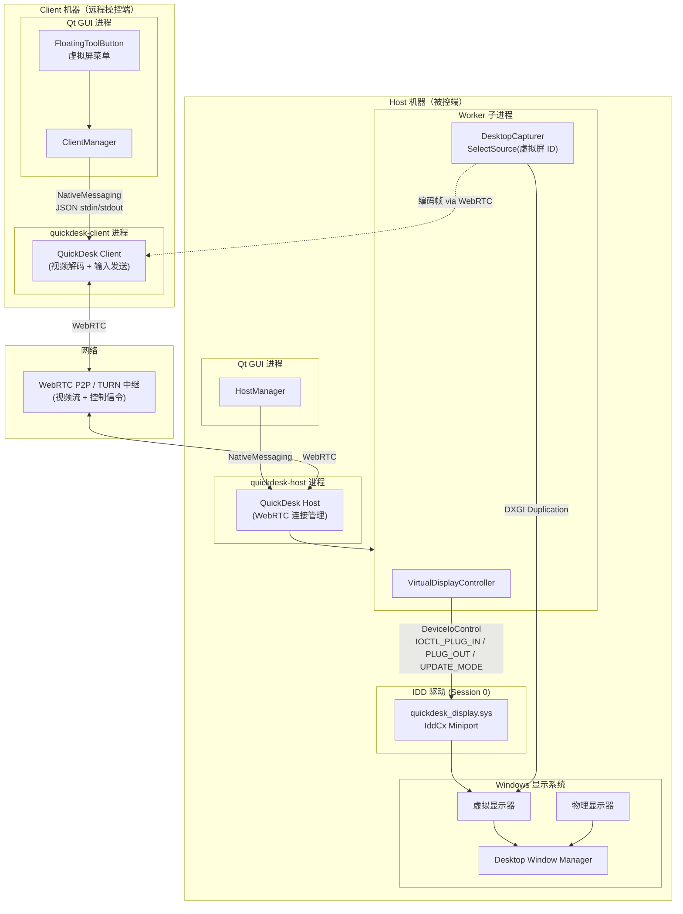
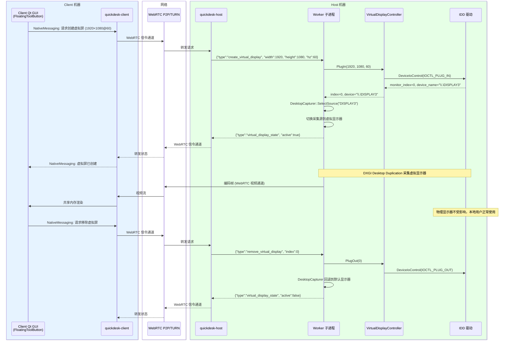
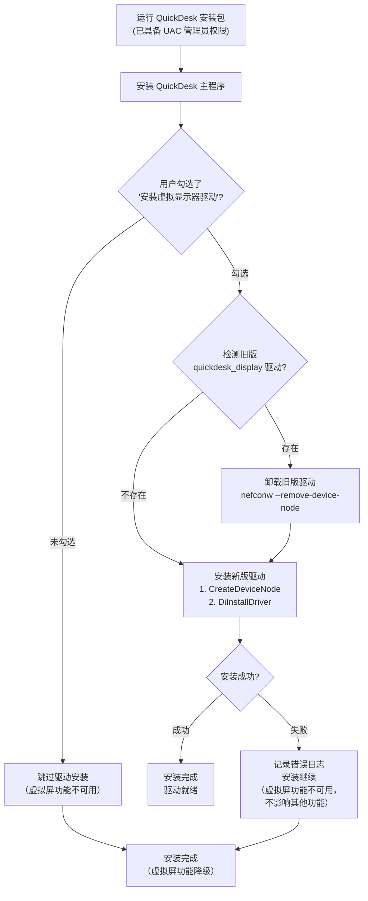
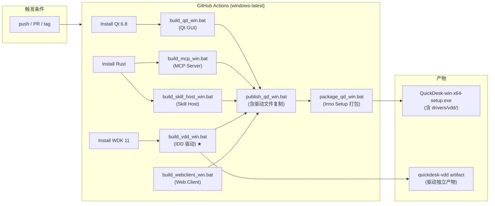
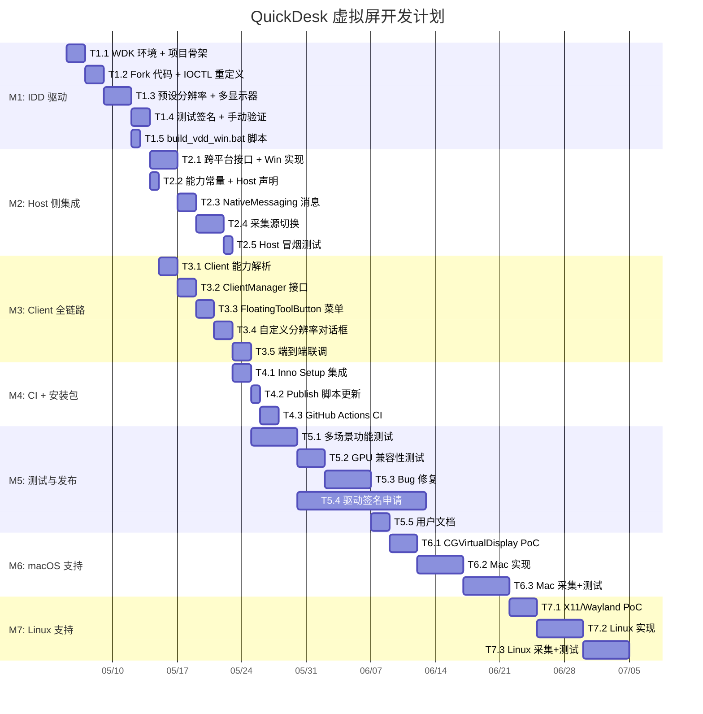
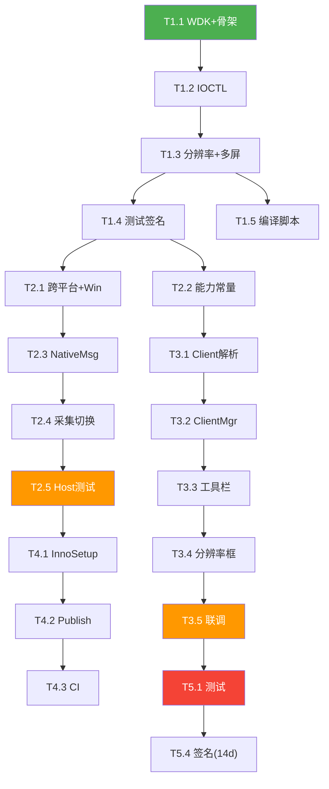

# QuickDesk 虚拟屏技术方案

## 1. 虚拟屏功能介绍

### 1.1 什么是虚拟屏

虚拟屏（Virtual Display）是一种通过软件模拟的显示输出设备，操作系统将其视为真实的物理显示器。虚拟屏没有对应的物理硬件（LCD/LED 面板），但在系统层面具备完整的显示器能力：拥有分辨率、刷新率、色深等属性，支持桌面扩展、窗口拖放、DXGI 采集等标准操作。

### 1.2 远程桌面中的虚拟屏应用场景

| 场景 | 说明 | 核心价值 |
|------|------|---------|
| **多屏扩展** | 远程用户在无物理多屏的 host 上创建额外显示器，获得多屏工作空间 | 提升远程办公效率 |
| **Headless 服务器** | 无头服务器没有物理显示器，需要虚拟屏来获得桌面环境供远程访问 | 无需 HDMI Dongle 即可远程 |
| **隐私隔离** | 远程用户在虚拟屏上操作，本地用户在物理屏上操作，两者互不干扰 | 多用户独立桌面 |
| **分辨率自适应** | 虚拟屏分辨率可动态匹配 Client 端屏幕，无需修改物理显示器设置 | 最佳视觉体验 |
| **游戏/流媒体串流** | 创建高刷新率虚拟屏（144Hz/240Hz）用于云游戏串流 | 低延迟高帧率 |

### 1.3 虚拟屏 vs 隐私屏

| 维度 | 隐私屏 (Privacy Screen) | 虚拟屏 (Virtual Display) |
|------|------------------------|------------------------|
| **本质** | 遮挡物理屏幕，单桌面会话 | 创建新显示器，独立桌面空间 |
| **用户数** | 单用户（远程用户独占） | 多用户（远程+本地各自独立） |
| **技术实现** | 置顶窗口 + WDA_EXCLUDEFROMCAPTURE | IDD 虚拟显示驱动 |
| **是否需要驱动** | 否 | 是（IDD Miniport Driver） |
| **物理屏状态** | 被黑色窗口遮挡 | 正常显示，本地用户可用 |
| **系统要求** | Windows 10 2004+ | Windows 10 2004+ |

---

## 2. 竞品虚拟屏功能调研

### 2.1 竞品功能对比总览

| 竞品 | 虚拟屏支持 | 隐私屏支持 | 实现方式 | 最大虚拟屏数量 | 自定义分辨率 | Headless 支持 | 平台 | 付费要求 |
|------|-----------|-----------|---------|-------------|------------|-------------|------|---------|
| **TeamViewer** | ✅ | ✅ (Black Screen) | 自研 IDD 驱动 | 多个 | ✅ | ✅ | Windows | Premium+ |
| **RustDesk** | ✅ | ✅ | 开源 IDD 驱动 (RustDeskIddDriver) | 多个 | ✅ | ✅ | Windows | 免费 |
| **AnyDesk** | ❌ | ✅ (Privacy Mode) | — | — | — | 部分 | 跨平台 | Professional+ |
| **ToDesk** | ✅ | ✅ | 自研驱动 | 有限 | 有限 | ✅ | Windows | 付费 |
| **BildDesk** | ❌ | ✅ | — | — | — | ❌ | Windows | 付费 |
| **Parsec** | ✅ | ✅ | 自研 IDD 驱动 (parsec-vdd) | 16/适配器 | ✅（注册表） | ✅ | Windows | Teams/Warp |
| **Sunshine/Moonlight** | ✅ | ✅ | 第三方 IDD (VDD-HDR) | 多个 | ✅ | ✅ | Windows | 免费 |
| **Chrome Remote Desktop** | ❌ | ✅ (Curtain Mode) | — | — | — | 部分 | 跨平台 | 免费 |

### 2.2 各竞品详细分析

#### 2.2.1 TeamViewer

**虚拟屏实现**：
- 内置自研 IDD 虚拟显示驱动，随 TeamViewer 安装包自动部署
- 远程会话中通过工具栏 `View → Manage virtual monitors → Add virtual monitor` 一键创建
- 支持会话内动态添加/移除虚拟显示器
- 支持 `Show all monitors on one screen` 全局视图

**前置条件**：
- Host 端需安装 Full Client 或 Host 模块
- 需 Windows 10 2004+
- 仅 Windows → Windows 连接支持
- 需设备已托管且启用 Easy Access

**用户体验**：
- 全流程在远程会话 UI 内完成，无需命令行操作
- 虚拟屏创建后自动出现在 Windows 显示设置中
- 会话断开后虚拟屏自动清理

**不足**：
- 仅 Premium、Corporate、Tensor 许可证用户可用
- 不开源，无法定制

#### 2.2.2 RustDesk

**虚拟屏实现**：
- 使用开源 [RustDeskIddDriver](https://github.com/rustdesk-org/RustDeskIddDriver)，基于 Microsoft IddCx Sample
- 驱动通过 IOCTL 接口支持：
  - `IOCTL_CHANGER_IDD_PLUG_IN`：插入虚拟显示器
  - `IOCTL_CHANGER_IDD_PLUG_OUT`：拔出虚拟显示器
  - `IOCTL_CHANGER_IDD_UPDATE_MONITOR_MODE`：更新显示模式
- 用户态控制通过 `RustDeskIddApp` 演示
- IddCx 版本 1.2，功能基础但稳定

**隐私屏实现**：
- `win_topmost_window.rs`：创建全屏置顶窗口
- `win_exclude_from_capture.rs`：`SetWindowDisplayAffinity(WDA_EXCLUDEFROMCAPTURE)`
- `win_input.rs`：低级钩子拦截物理输入

**开源优势**：
- MS-PL 许可证，可自由修改和分发
- 代码结构清晰，适合二次开发
- 驱动签名使用测试签名

**不足**：
- IddCx 1.2 版本较旧，不支持硬件鼠标光标（会出现双光标问题）
- 不支持 HDR
- 驱动未经微软正式签名

#### 2.2.3 AnyDesk

**隐私屏**：
- 称为 "Privacy Mode"，远程连接时黑掉远端物理屏幕
- 文档描述为 "Keep your session private by blackening the screen of your remote device"

**虚拟屏**：
- 目前**不支持**虚拟屏功能
- Headless 场景依赖物理 HDMI Dongle 或操作系统自身的远程桌面能力

#### 2.2.4 ToDesk

**虚拟屏实现**：
- 自研虚拟显示驱动，集成在专业版中
- 支持在远程会话中创建虚拟显示器
- 主要面向 Headless 服务器场景

**不足**：
- 闭源商业软件，无技术细节公开
- 自定义分辨率能力有限
- 仅付费用户可用

#### 2.2.5 Parsec

**虚拟屏实现**：
- 自研 IDD 驱动 `parsec-vdd`（mm.dll），IddCx 1.5
- 单适配器最多支持 **16 个**虚拟显示器
- 丰富的预设分辨率模式：
  - 4K UHD (3840×2160) @ 24/30/60/144/240Hz
  - 2K (2560×1440) @ 24/30/60/144/240Hz
  - FHD (1920×1080) @ 24/30/60/144/240Hz
  - UltraWide (3440×1440, 2560×1080)
- 支持自定义分辨率（通过注册表 `HKLM\SOFTWARE\Parsec\vdd`，最多 5 个）
- **需要定期 ping 驱动保持虚拟屏存活**，否则 1 秒后自动拔出

**核心 API**（C/C++ 单头文件）：
```c
// 初始化设备
VddStatus VddInit(VddHandle* handle);
// 插入虚拟显示器
VddStatus VddPlugIn(VddHandle handle, int* index);
// 拔出虚拟显示器
VddStatus VddPlugOut(VddHandle handle, int index);
// 保活 ping
VddStatus VddPing(VddHandle handle);
```

**已知问题**：
- 不支持 HDR（需修改驱动 DLL 内嵌 EDID）
- Privacy Mode 与虚拟屏存在兼容性问题（会关闭物理显示器）
- 驱动有数字签名（Parsec 官方签名）

#### 2.2.6 Sunshine/Moonlight 生态

- 使用社区 [Virtual-Display-Driver (HDR)](https://github.com/VirtualDrivers/Virtual-Display-Driver)
- IddCx 1.10（最新），功能最全：
  - HDR 支持（10-bit / 12-bit）
  - 自定义 EDID
  - 多 GPU 选择（PCI-bus LUID）
  - ARM64 支持
  - 硬件光标支持
- 9000+ Stars，社区活跃
- MIT 许可证
- 通过 SignPath.io 提供免费代码签名

### 2.3 开源 IDD 驱动对比

| 项目 | IddCx 版本 | 已签名 | 硬件光标 | HDR | 自定义分辨率 | EDID 自定义 | Stars | 许可证 |
|------|-----------|--------|---------|-----|-----------|-----------|-------|--------|
| **Virtual-Display-Driver (HDR)** | 1.10 | ✅ | ✅ | ✅ (10/12bit) | ✅ | ✅ | 9k | MIT |
| **parsec-vdd** | 1.5 | ✅ | 🆗 有限 | ❌ | ✅ 有限 | ❌ | 5.2k | MIT |
| **virtual-display-rs** | 1.5 | ❌ | ✅ | ❌ | ✅ | ❌ | — | — |
| **RustDeskIddDriver** | 1.2 | ❌ | ❌ | ❌ | ❌ | ❌ | 97 | MS-PL |
| **ge9/IddSampleDriver** | 1.2 | ❌ | ❌ | ❌ | ✅ | ❌ | 939 | MIT |
| **MS IddSample (官方)** | 1.4 | — | — | — | — | — | — | MS |

---

## 3. 市面上的虚拟屏实现方案

### 3.1 方案分类



### 3.2 方案详细对比

#### 方案 A：IDD 虚拟显示驱动（推荐）

**原理**：通过 Windows IddCx（Indirect Display Driver Class eXtension）框架开发 UMDF 用户态驱动，向系统注册虚拟显示适配器和虚拟显示器。



**架构说明**：
- IDD 驱动运行在 **Session 0 用户态**（UMDF 2.x），不是内核驱动
- 驱动通过 IddCx 回调实现：
  - `EVT_IDD_CX_ADAPTER_INIT_FINISHED`：适配器初始化
  - `EVT_IDD_CX_ADAPTER_COMMIT_MODES`：提交显示模式
  - `EVT_IDD_CX_MONITOR_GET_DEFAULT_DESCRIPTION_MODES`：报告支持的分辨率
  - `EVT_IDD_CX_MONITOR_ASSIGN_SWAPCHAIN`：交换链分配（帧处理）
- 用户态应用通过 `DeviceIoControl` 与驱动通信（IOCTL）
- 虚拟显示器对 DWM 和 DXGI 完全透明，标准采集 API 可直接使用

**核心代码结构**（基于 Microsoft IddSample）：
- `Direct3DDevice` 类：枚举 GPU、创建 D3D 设备
- `SwapChainProcessor` 类：专用线程处理交换链帧
- `IndirectDeviceContext` 类：处理 IddCx 回调，管理显示器生命周期

**优势**：
- 系统原生支持，虚拟屏与物理屏行为一致
- UMDF 用户态运行，驱动崩溃不会蓝屏
- 支持 DXGI Desktop Duplication 标准采集
- 支持高分辨率（4K+）和高刷新率（240Hz+）
- 支持多显示器热插拔

**劣势**：
- 需要 WDK 开发环境
- 正式发布需要驱动签名（EV 代码签名 + Microsoft Attestation）
- 仅 Windows 平台

#### 方案 B：USB 虚拟显示适配器 (usbmmidd)

**原理**：通过虚拟 USB 设备模拟 USB 显示适配器，间接创建虚拟显示器。

**优势**：
- 早期 Windows 版本（Win7/8）即可使用
- 无需 IddCx 框架

**劣势**：
- 架构过时，微软已推荐 IDD 替代
- 稳定性和兼容性较差
- 不支持高刷新率和 HDR
- 需要额外的虚拟 USB 总线驱动

**结论**：已淘汰，不推荐。

#### 方案 C：RDP 虚拟桌面

**原理**：利用 Windows 远程桌面服务（RDS）内置的虚拟桌面能力。

**优势**：
- 无需额外驱动
- Windows Server 原生支持多会话

**劣势**：
- Windows 桌面版不支持多会话（需破解 termsrv.dll）
- 与第三方远程桌面产品冲突
- 不支持 GPU 加速
- 许可证合规风险

**结论**：不适合第三方远程桌面产品使用。

#### 方案 D：图形 Hook

**原理**：Hook D3D/DXGI 调用，在虚拟的渲染目标上绘制并采集。

**优势**：
- 纯软件实现，无需驱动

**劣势**：
- 极不稳定，受反作弊和安全软件影响
- 兼容性差，不同应用行为不一致
- 无法在系统显示设置中显示为真实显示器
- 不支持桌面扩展

**结论**：不适合生产环境。

### 3.3 方案选择矩阵

| 评价维度 | IDD 驱动 (A) | USB 虚拟 (B) | RDP 虚拟 (C) | 图形 Hook (D) |
|---------|-------------|-------------|-------------|-------------|
| 系统集成度 | ⭐⭐⭐⭐⭐ | ⭐⭐⭐ | ⭐⭐⭐⭐ | ⭐⭐ |
| 性能 | ⭐⭐⭐⭐⭐ | ⭐⭐⭐ | ⭐⭐⭐ | ⭐⭐ |
| 稳定性 | ⭐⭐⭐⭐ | ⭐⭐⭐ | ⭐⭐⭐⭐ | ⭐ |
| 开发难度 | ⭐⭐⭐ | ⭐⭐ | ⭐⭐⭐⭐ | ⭐⭐ |
| 驱动签名要求 | 需要 | 需要 | 不需要 | 不需要 |
| 未来可维护性 | ⭐⭐⭐⭐⭐ | ⭐⭐ | ⭐⭐⭐ | ⭐ |
| 竞品采用率 | 最高 | 淘汰中 | 极少 | 无 |

---

## 4. 适合 QuickDesk 的技术方案

### 4.1 方案选型：基于开源 IDD 驱动二次开发

**结论**：采用 **IDD 虚拟显示驱动方案**，基于开源项目二次开发。

**选型理由**：

1. **行业标准**：TeamViewer、RustDesk、Parsec、Sunshine 等主流竞品均采用 IDD 方案
2. **微软官方支持**：IddCx 是微软推荐的虚拟显示驱动框架，有官方文档和示例
3. **用户态驱动**：UMDF 运行在用户态 Session 0，不会导致蓝屏，稳定性好
4. **功能完整**：支持多显示器、自定义分辨率、高刷新率、DXGI 采集
5. **开源生态成熟**：多个高质量开源 IDD 驱动可供参考

### 4.2 基础驱动选型

| 候选基础 | 推荐度 | 理由 |
|---------|--------|------|
| **RustDeskIddDriver** | ⭐⭐⭐⭐⭐ **首选** | IOCTL 接口设计清晰（Plug In/Out/Update Mode），代码精简，MS-PL 许可证友好，已在 RustDesk 生产环境验证 |
| Virtual-Display-Driver (HDR) | ⭐⭐⭐⭐ 备选 | 功能最全（HDR、EDID、硬件光标），但代码复杂度高，可能引入不必要的功能 |
| Microsoft IddSample | ⭐⭐⭐ 参考 | 官方示例，代码最简，但缺少生产级功能（无热插拔 IOCTL、无动态模式切换） |
| parsec-vdd | ⭐⭐⭐ 参考 | 闭源驱动 DLL，仅头文件 API 可参考设计 |

**最终选择**：以 **RustDeskIddDriver** 为基础，参考 Virtual-Display-Driver (HDR) 的高级特性进行二次开发。

**命名**：`quickdesk-virtual-display` / `quickdesk_display.sys`

### 4.3 整体架构设计



**数据流说明**：
1. Client 机器上，用户通过 FloatingToolButton 点击虚拟屏菜单 → ClientManager → NativeMessaging → quickdesk-client 进程
2. quickdesk-client 通过 **WebRTC 信令通道** 将虚拟屏请求发送到 Host 机器的 quickdesk-host
3. quickdesk-host 指令 Worker 子进程创建虚拟屏 → VirtualDisplayController → DeviceIoControl → IDD 驱动
4. Worker 的 DesktopCapturer 采集虚拟显示器画面 → 编码 → 通过 WebRTC 传回 Client
5. Client 解码并渲染到 Qt GUI 窗口

### 4.4 驱动层设计

#### 4.4.1 IOCTL 接口定义

```cpp
// quickdesk-virtual-display/driver/Public.h

// 插入一个虚拟显示器
// Input: QUICKDESK_PLUG_IN_PARAMS（分辨率、刷新率）
// Output: QUICKDESK_PLUG_IN_RESULT（显示器索引、显示器 ID）
#define IOCTL_QUICKDESK_VD_PLUG_IN \
    CTL_CODE(FILE_DEVICE_UNKNOWN, 0x901, METHOD_BUFFERED, FILE_ANY_ACCESS)

// 拔出一个虚拟显示器
// Input: QUICKDESK_PLUG_OUT_PARAMS（显示器索引）
#define IOCTL_QUICKDESK_VD_PLUG_OUT \
    CTL_CODE(FILE_DEVICE_UNKNOWN, 0x902, METHOD_BUFFERED, FILE_ANY_ACCESS)

// 更新虚拟显示器模式（分辨率/刷新率）
// Input: QUICKDESK_UPDATE_MODE_PARAMS
#define IOCTL_QUICKDESK_VD_UPDATE_MODE \
    CTL_CODE(FILE_DEVICE_UNKNOWN, 0x903, METHOD_BUFFERED, FILE_ANY_ACCESS)

// 查询当前虚拟显示器状态
// Output: QUICKDESK_QUERY_RESULT
#define IOCTL_QUICKDESK_VD_QUERY \
    CTL_CODE(FILE_DEVICE_UNKNOWN, 0x904, METHOD_BUFFERED, FILE_ANY_ACCESS)
```

#### 4.4.2 数据结构

```cpp
// quickdesk-virtual-display/driver/Public.h

struct QUICKDESK_PLUG_IN_PARAMS {
    UINT32 width;           // 期望宽度，0 = 使用默认
    UINT32 height;          // 期望高度，0 = 使用默认
    UINT32 refresh_rate;    // 期望刷新率 (Hz)，0 = 60
};

struct QUICKDESK_PLUG_IN_RESULT {
    UINT32 monitor_index;   // 分配的显示器索引
    WCHAR  device_name[32]; // 显示器设备名，如 "\\.\DISPLAY3"
};

struct QUICKDESK_PLUG_OUT_PARAMS {
    UINT32 monitor_index;
};

struct QUICKDESK_UPDATE_MODE_PARAMS {
    UINT32 monitor_index;
    UINT32 width;
    UINT32 height;
    UINT32 refresh_rate;
};

struct QUICKDESK_QUERY_RESULT {
    UINT32 active_count;    // 当前活跃虚拟显示器数量
    struct {
        UINT32 index;
        UINT32 width;
        UINT32 height;
        UINT32 refresh_rate;
        WCHAR  device_name[32];
    } monitors[16];         // 最多 16 个
};
```

#### 4.4.3 支持的显示模式

```cpp
// 预设分辨率列表
static const DisplayMode kPresetModes[] = {
    // 4K
    {3840, 2160, 60},
    {3840, 2160, 30},
    // 2K
    {2560, 1440, 144},
    {2560, 1440, 60},
    // FHD
    {1920, 1080, 144},
    {1920, 1080, 60},
    // HD+
    {1600, 900, 60},
    // HD
    {1280, 720, 60},
    // 常见笔记本分辨率
    {1366, 768, 60},
    {1440, 900, 60},
    {1680, 1050, 60},
    // UltraWide
    {2560, 1080, 60},
    {3440, 1440, 60},
};
```

### 4.5 跨平台抽象层设计

参考 RustDesk 的平台抽象层（PAD）设计，QuickDesk 的虚拟屏模块采用**统一接口 + 平台实现**的分层架构，Phase 1 实现 Windows，后续扩展 macOS 和 Linux。

#### 4.5.1 分层架构

```
┌─────────────────────────────────────────────────┐
│          QuickDesk Worker 进程                   │
│          (create/remove/query 虚拟屏)            │
├─────────────────────────────────────────────────┤
│       VirtualDisplayController (统一接口)         │
│       CreateDisplay / RemoveDisplay / UpdateMode │
│       QueryDisplays / IsSupported                │
├─────────────────────────────────────────────────┤
│              平台抽象层 (PAL)                     │
├───────────────┬─────────────────┬───────────────┤
│ Windows       │ macOS           │ Linux         │
│ IDD 驱动      │ CoreGraphics    │ X11 虚拟帧缓冲 │
│ (Win10 2004+) │ (macOS 10.15+)  │ (X11/Wayland) │
│ DeviceIoCtl   │ CGVirtualDisplay│ Xvfb/KMS      │
│ ★ Phase 1     │ ☆ Phase 3       │ ☆ Phase 4     │
└───────────────┴─────────────────┴───────────────┘
```

#### 4.5.2 平台实现方案

| 平台 | 技术方案 | 系统要求 | 驱动/权限 | 阶段 |
|------|---------|---------|----------|------|
| **Windows** | IDD 驱动 (IddCx) | Win10 2004+ | quickdesk_display.sys + DeviceIoControl | Phase 1 |
| **macOS** | CoreGraphics CGVirtualDisplay API | macOS 10.15+ | 无需驱动，需屏幕录制权限 | Phase 3 |
| **Linux** | X11: Xvfb 虚拟帧缓冲 / XRandR 虚拟输出；Wayland: KMS virtual connector | 内核 4.15+ | 无需驱动，可能需 root | Phase 4 |

**macOS 方案说明**：
- macOS 10.15+ 提供 `CGVirtualDisplay` / `CGVirtualDisplayDescriptor` API，可在用户态创建虚拟显示器
- 无需内核扩展（kext），不受 SIP 限制
- 需要屏幕录制权限（`CGDisplayStream`）

**Linux 方案说明**：
- X11 环境：通过 XRandR 创建虚拟输出（`xrandr --addmode`），或使用 Xvfb 虚拟帧缓冲
- Wayland 环境：通过 KMS/DRM virtual connector 创建虚拟显示器
- Headless 场景可直接使用 Xvfb 启动完整桌面环境

#### 4.5.3 统一接口设计

```cpp
// src/remoting/quickdesk/host/virtual_display_controller.h

namespace remoting::quickdesk {

struct VirtualMonitorInfo {
  int index;
  int width;
  int height;
  int refresh_rate;
  std::string device_name;  // 跨平台使用 std::string
};

// 跨平台统一接口
class VirtualDisplayController {
 public:
  virtual ~VirtualDisplayController() = default;

  // 当前平台是否支持虚拟屏
  static bool IsSupported();

  // 创建平台对应的实现实例
  static std::unique_ptr<VirtualDisplayController> Create();

  // 创建虚拟显示器，返回显示器索引，失败返回 -1
  virtual int CreateDisplay(int width, int height, int refresh_rate) = 0;

  // 移除虚拟显示器
  virtual bool RemoveDisplay(int monitor_index) = 0;

  // 更新显示模式
  virtual bool UpdateMode(int monitor_index,
                          int width, int height, int refresh_rate) = 0;

  // 查询当前活跃虚拟显示器
  virtual std::vector<VirtualMonitorInfo> QueryDisplays() = 0;

  // 移除所有虚拟显示器
  virtual void RemoveAll() = 0;
};

}  // namespace remoting::quickdesk
```

#### 4.5.4 Windows 实现（Phase 1）

```cpp
// src/remoting/quickdesk/host/virtual_display_controller_win.h

class VirtualDisplayControllerWin : public VirtualDisplayController {
 public:
  VirtualDisplayControllerWin();
  ~VirtualDisplayControllerWin() override;

  int CreateDisplay(int width, int height, int refresh_rate) override;
  bool RemoveDisplay(int monitor_index) override;
  bool UpdateMode(int monitor_index,
                  int width, int height, int refresh_rate) override;
  std::vector<VirtualMonitorInfo> QueryDisplays() override;
  void RemoveAll() override;

 private:
  bool OpenDevice();
  void CloseDevice();
  bool SendIoctl(DWORD ioctl_code, void* input, DWORD input_size,
                 void* output, DWORD output_size);

  HANDLE device_handle_ = INVALID_HANDLE_VALUE;
};
```

#### 4.5.5 工厂方法（编译期平台选择）

```cpp
// src/remoting/quickdesk/host/virtual_display_controller.cc

// static
std::unique_ptr<VirtualDisplayController> VirtualDisplayController::Create() {
#if BUILDFLAG(IS_WIN)
  return std::make_unique<VirtualDisplayControllerWin>();
#elif BUILDFLAG(IS_MAC)
  return std::make_unique<VirtualDisplayControllerMac>();  // Phase 3
#elif BUILDFLAG(IS_LINUX)
  return std::make_unique<VirtualDisplayControllerLinux>(); // Phase 4
#else
  return nullptr;
#endif
}

// static
bool VirtualDisplayController::IsSupported() {
#if BUILDFLAG(IS_WIN)
  return base::win::GetVersion() >= base::win::Version::WIN10_20H1
      && VirtualDisplayControllerWin::IsDriverInstalled();
#elif BUILDFLAG(IS_MAC)
  return base::mac::MacOSMajorVersion() >= 15;  // macOS 10.15+
#elif BUILDFLAG(IS_LINUX)
  return /* 检查 Xvfb/XRandR 可用性 */;
#else
  return false;
#endif
}
```

### 4.6 Worker 采集集成

虚拟屏创建后，Worker 的 `DesktopCapturer` 需要选择采集虚拟显示器而非物理显示器：



### 4.7 Client UI 设计

复用现有能力协商模式（参考隐私屏方案），在 `FloatingToolButton` 菜单中集成虚拟屏管理：

```
┌─────────────────────────────────────┐
│  FloatingToolButton 菜单            │
│  ─────────────────────────────      │
│  📋 Send Ctrl+Alt+Del              │
│  🔒 Lock Screen                    │
│  📁 File Transfer                  │
│  ─────────────────────────────      │
│  🔲 Privacy Screen                 │
│  🖥️ Virtual Display  ──────────┐   │
│                       │ Add 1920×1080 @60Hz  │
│                       │ Add 2560×1440 @60Hz  │
│                       │ Add Custom...        │
│                       │ ──────────────       │
│                       │ ✅ DISPLAY3 (1920×1080) [Remove] │
│                       └──────────────────────┘
└─────────────────────────────────────┘
```

### 4.8 驱动签名策略

| 阶段 | 签名方式 | 说明 |
|------|---------|------|
| **开发阶段** | 测试签名 | `bcdedit /set testsigning on`，开发机上使用 |
| **内部测试** | 自签名 + 测试签名 | 内部测试环境使用 |
| **公开 Beta** | SignPath.io 免费签名 | 开源项目可申请免费代码签名（Virtual-Display-Driver 使用此方案） |
| **正式发布** | EV 代码签名 + Microsoft Attestation | 标准 Windows 驱动发布流程，需 2-4 周审核 |

### 4.9 驱动安装部署

虚拟显示驱动随 QuickDesk 安装包一起分发。安装包本身以管理员权限运行（UAC 已在安装包入口统一提权），用户可在安装向导的"选择附加任务"页面中决定是否安装驱动（**默认勾选**）。



**安装策略**：
- 驱动文件（`quickdesk_display.sys`、`quickdesk_display.inf`、`quickdesk_display.cat`、`nefconw.exe`）打包在安装包内的 `drivers/vdd/` 目录
- 安装向导提供"安装虚拟显示器驱动"复选框（Inno Setup `[Tasks]`），**默认勾选**（`Flags: checkedonce`），用户可取消
- 安装包执行过程中，**先检测并卸载旧版驱动，再安装新版**，确保版本一致
- 驱动安装失败不阻塞整体安装流程，仅虚拟屏功能不可用，其他功能（远程控制、隐私屏等）正常
- 卸载 QuickDesk 时同步卸载虚拟显示驱动（无论安装时是否勾选）

**安装脚本集成**（在 `scripts/installer/` 中调用）：

```batch
:: 安装包中的驱动安装步骤（已在 UAC 管理员上下文中）

:: 1. 卸载旧版驱动（如果存在）
nefconw.exe --remove-device-node --hardware-id Root\QuickDesk\VDD --class-guid "4D36E968-E325-11CE-BFC1-08002BE10318"

:: 2. 创建设备节点
nefconw.exe --create-device-node --class-name Display --class-guid "4D36E968-E325-11CE-BFC1-08002BE10318" --hardware-id Root\QuickDesk\VDD

:: 3. 安装驱动
nefconw.exe --install-driver --inf-path "%INSTALL_DIR%\drivers\vdd\quickdesk_display.inf"
```

**卸载时清理**：

```batch
:: QuickDesk 卸载流程中的驱动清理步骤
nefconw.exe --remove-device-node --hardware-id Root\QuickDesk\VDD --class-guid "4D36E968-E325-11CE-BFC1-08002BE10318"
```

**运行时检测**：Host 启动时通过 `VirtualDisplayControllerWin::IsDriverInstalled()` 检查驱动状态，决定是否声明 `virtualDisplay` 能力。驱动不存在时，Client 端虚拟屏按钮自动隐藏。

---

## 5. 项目组织与关键文件

### 5.1 驱动源码存放位置

驱动源码放在 **QuickDesk monorepo 内**，作为 `quickdesk-virtual-display/` 目录与现有子项目平级：

```
QuickDesk/                          # monorepo 根目录
├── QuickDesk/                      # Qt GUI 客户端
├── quickdesk-mcp/                  # MCP Server (Rust)
├── quickdesk-skill-host/           # Skill Host (Rust)
├── quickdesk-virtual-display/      # ★ 虚拟显示驱动（新增，WDK C++）
│   ├── driver/                     #   IDD 驱动源码
│   ├── control/                    #   用户态控制库
│   └── installer/                  #   安装/卸载脚本
├── SignalingServer/                 # 信令服务器 (Go)
├── WebClient/                      # Web 客户端
├── scripts/                        # 构建/打包脚本
└── docs/                           # 文档
```

**选择 monorepo 的理由**：
- 与 `quickdesk-mcp/`、`SignalingServer/`、`WebClient/` 等子项目组织方式一致
- 驱动接口变更与 Host 侧调用方可在同一个 PR 中 review
- 安装包构建流程直接引用 `quickdesk-virtual-display/` 产物，无需跨仓库依赖
- 一个 git tag 覆盖所有组件版本，发布流程简单
- WDK 构建系统与 CMake/Cargo 互不干扰，天然隔离

### 5.2 需要新增的文件

| 文件/目录 | 说明 |
|----------|------|
| `quickdesk-virtual-display/` | 新项目根目录（Windows IDD 驱动） |
| `quickdesk-virtual-display/driver/quickdesk_display.cpp` | IDD 驱动主文件（IddCx 回调实现） |
| `quickdesk-virtual-display/driver/quickdesk_display.inf` | 驱动安装信息文件 |
| `quickdesk-virtual-display/driver/Public.h` | IOCTL 定义和数据结构 |
| `quickdesk-virtual-display/driver/SwapChainProcessor.cpp` | 交换链帧处理 |
| `quickdesk-virtual-display/driver/Direct3DDevice.cpp` | D3D 设备管理 |
| `quickdesk-virtual-display/control/vdd_control.h/cpp` | 用户态控制库 |
| `quickdesk-virtual-display/installer/` | 驱动安装器 |
| `src/remoting/quickdesk/host/virtual_display_controller.h/cc` | **跨平台统一接口** + 工厂方法 |
| `src/remoting/quickdesk/host/virtual_display_controller_win.h/cc` | Windows IDD 驱动实现（Phase 1） |
| `src/remoting/quickdesk/host/virtual_display_controller_mac.h/mm` | macOS CoreGraphics 实现（Phase 3） |
| `src/remoting/quickdesk/host/virtual_display_controller_linux.h/cc` | Linux X11/Wayland 实现（Phase 4） |

### 5.3 需要修改的文件

| 文件 | 修改内容 |
|------|---------|
| `src/remoting/quickdesk/host/quickdesk_host.cc` | 添加 `virtualDisplay` 能力声明；处理虚拟屏创建/销毁消息 |
| `src/remoting/quickdesk/host/quickdesk_native_messaging_host.cc` | 新增 `create_virtual_display` / `remove_virtual_display` 消息处理 |
| `src/remoting/quickdesk/host/BUILD.gn` | 新增文件编译 |
| `src/remoting/quickdesk/client/common/quickdesk_client.cc` | 解析 `virtualDisplay` 能力 |
| `src/remoting/quickdesk/client/common/quickdesk_native_messaging_client.cc` | JSON 消息扩展 |
| `QuickDesk/QuickDesk/src/manager/ClientManager.h/cpp` | 扩展虚拟屏管理接口和信号 |
| `QuickDesk/QuickDesk/qml/quickdeskcomponent/FloatingToolButton.qml` | 新增虚拟屏子菜单 |
| `QuickDesk/QuickDesk/qml/views/RemoteWindow.qml` | 绑定虚拟屏能力属性 |

### 5.4 需要新增的 CI/构建文件

| 文件 | 说明 |
|------|------|
| `scripts/build_vdd_win.bat` | Windows 虚拟显示驱动编译脚本 |
| `scripts/installer/install_vdd.bat` | 驱动安装脚本（安装包内调用） |
| `scripts/installer/uninstall_vdd.bat` | 驱动卸载脚本（卸载时调用） |
| `.github/workflows/quickdesk-vdd.yml` | 驱动独立 CI 工作流（编译+签名） |

---

## 6. 编译、打包与 CI

### 6.1 驱动编译脚本

新增 `scripts/build_vdd_win.bat`，与现有 `build_qd_win.bat`、`build_mcp_win.bat` 等脚本风格一致：

```batch
@echo off
:: scripts/build_vdd_win.bat
:: 编译 quickdesk-virtual-display IDD 驱动
:: 依赖: WDK 11, VS 2022, EWDK (可选)

echo ---------------------------------------------------------------
echo Build QuickDesk Virtual Display Driver
echo ---------------------------------------------------------------

set script_path=%~dp0
cd /d %script_path%

SETLOCAL EnableDelayedExpansion
set build_mode=Release
set errno=1

:parse_args
if "%1"=="" goto args_done
if /i "%1"=="debug" set build_mode=Debug
if /i "%1"=="release" set build_mode=Release
shift
goto parse_args
:args_done

echo [*] build mode: %build_mode%

set vdd_project=%script_path%..\quickdesk-virtual-display
set vdd_sln=%vdd_project%\quickdesk-virtual-display.sln
set output_path=%script_path%..\output\x64\%build_mode%\drivers\vdd

:: 编译驱动 (MSBuild + WDK)
echo [*] building driver...
msbuild "%vdd_sln%" /p:Configuration=%build_mode% /p:Platform=x64

if %errorlevel% neq 0 (
    echo [!] driver build failed
    exit /b 1
)

:: 复制产物到统一输出目录
echo [*] copying driver files to %output_path%
if not exist "%output_path%" mkdir "%output_path%"
copy /y "%vdd_project%\x64\%build_mode%\quickdesk_display\quickdesk_display.sys" "%output_path%\"
copy /y "%vdd_project%\x64\%build_mode%\quickdesk_display\quickdesk_display.inf" "%output_path%\"
copy /y "%vdd_project%\x64\%build_mode%\quickdesk_display\quickdesk_display.cat" "%output_path%\"
:: nefconw 工具一起打包
copy /y "%vdd_project%\tools\nefconw.exe" "%output_path%\"

echo [*] driver build completed
exit /b 0
```

### 6.2 安装包集成

在现有 Inno Setup 脚本 `scripts/installer/quickdesk.iss` 中新增驱动可选安装/卸载步骤：

**国际化文本**（`[CustomMessages]` 段）：
```iss
english.VirtualDisplayDriver=Virtual Display Driver:
english.InstallVirtualDisplayDriver=Install virtual display driver (required for virtual display feature)
chinesesimplified.VirtualDisplayDriver=虚拟显示器驱动：
chinesesimplified.InstallVirtualDisplayDriver=安装虚拟显示器驱动（虚拟屏功能需要）
```

**用户可选任务**（`[Tasks]` 段）：
```iss
Name: "vdd"; Description: "{cm:InstallVirtualDisplayDriver}"; GroupDescription: "{cm:VirtualDisplayDriver}"; Flags: checkedonce
```

> `Flags: checkedonce` 表示首次安装默认勾选，升级安装时保留用户上次的选择。

**打包驱动文件**（`[Files]` 段，仅用户勾选时安装）：
```iss
Source: "{#MyPublishDir}\drivers\vdd\*"; DestDir: "{app}\drivers\vdd"; Flags: ignoreversion recursesubdirs createallsubdirs; Tasks: vdd
```

**安装时部署驱动**（`[Run]` 段，通过 `Tasks: vdd` 条件化，在 Host Service 安装之前执行）：
```iss
; 卸载旧版虚拟显示驱动（如果存在）
Filename: "{app}\drivers\vdd\nefconw.exe"; Parameters: "--remove-device-node --hardware-id Root\QuickDesk\VDD --class-guid ""{{4D36E968-E325-11CE-BFC1-08002BE10318}}"""; StatusMsg: "Removing old virtual display driver..."; Flags: runhidden waituntilterminated; Tasks: vdd
; 创建设备节点
Filename: "{app}\drivers\vdd\nefconw.exe"; Parameters: "--create-device-node --class-name Display --class-guid ""{{4D36E968-E325-11CE-BFC1-08002BE10318}}"" --hardware-id Root\QuickDesk\VDD"; StatusMsg: "Creating virtual display device..."; Flags: runhidden waituntilterminated; Tasks: vdd
; 安装驱动
Filename: "{app}\drivers\vdd\nefconw.exe"; Parameters: "--install-driver --inf-path ""{app}\drivers\vdd\quickdesk_display.inf"""; StatusMsg: "Installing virtual display driver..."; Flags: runhidden waituntilterminated; Tasks: vdd
```

**卸载时清理驱动**（`[Code]` 段 `CurUninstallStepChanged`，无论安装时是否勾选均清理）：
```pascal
procedure CurUninstallStepChanged(CurUninstallStep: TUninstallStep);
var
  ResultCode: Integer;
begin
  if CurUninstallStep = usUninstall then
  begin
    // ... 现有 Host Service 卸载代码 ...

    // 卸载虚拟显示驱动（无论安装时是否勾选，确保清理干净）
    if FileExists(ExpandConstant('{app}\drivers\vdd\nefconw.exe')) then
      Exec(ExpandConstant('{app}\drivers\vdd\nefconw.exe'),
           '--remove-device-node --hardware-id Root\QuickDesk\VDD --class-guid "{4D36E968-E325-11CE-BFC1-08002BE10318}"',
           '', SW_HIDE, ewWaitUntilTerminated, ResultCode);
  end;
end;
```

### 6.3 Publish 脚本更新

在 `scripts/publish_qd_win.bat` 中新增驱动产物的复制步骤：

```batch
:: 复制虚拟显示驱动到 publish 目录
set vdd_output=%script_path%..\output\x64\%build_mode%\drivers\vdd
if exist "%vdd_output%" (
    echo [*] copying virtual display driver...
    mkdir "%publish_path%drivers\vdd\"
    xcopy "%vdd_output%\*" "%publish_path%drivers\vdd\" /E /Y
) else (
    echo [!] warning: virtual display driver not found, skipping
)
```

### 6.4 GitHub Actions CI

#### 6.4.1 修改现有 `quickdesk-windows.yml`

在现有 Windows 构建流程中增加驱动编译步骤，位于 Build MCP 之后、Publish 之前：

```yaml
# .github/workflows/quickdesk-windows.yml 新增步骤

on:
  push:
    paths:
      # ... 现有 paths ...
      - 'quickdesk-virtual-display/**'      # ← 新增

      - name: Install WDK
        shell: pwsh
        run: |
          # 安装 Windows Driver Kit
          choco install windowsdriverkit11 -y --no-progress

      - name: Build Virtual Display Driver
        shell: cmd
        run: call scripts\build_vdd_win.bat Release
```

#### 6.4.2 新增驱动独立 CI（可选）

新增 `.github/workflows/quickdesk-vdd.yml`，仅在驱动代码变更时触发，加速迭代：

```yaml
# .github/workflows/quickdesk-vdd.yml
name: QuickDesk Virtual Display Driver

on:
  push:
    paths:
      - 'quickdesk-virtual-display/**'
      - '.github/workflows/quickdesk-vdd.yml'
  pull_request:
    paths:
      - 'quickdesk-virtual-display/**'
      - '.github/workflows/quickdesk-vdd.yml'
  workflow_dispatch:

permissions:
  contents: write

jobs:
  build:
    name: Build VDD
    runs-on: windows-latest
    steps:
      - uses: actions/checkout@v4

      - name: Install WDK
        shell: pwsh
        run: |
          choco install windowsdriverkit11 -y --no-progress

      - name: Detect VS environment
        shell: pwsh
        run: |
          $vs_install = & "${env:ProgramFiles(x86)}\Microsoft Visual Studio\Installer\vswhere.exe" `
            -latest -products * -property installationPath
          echo "VS_INSTALL=$vs_install" >> $env:GITHUB_ENV

      - name: Build driver
        shell: cmd
        run: call scripts\build_vdd_win.bat Release

      - name: Upload driver artifact
        uses: actions/upload-artifact@v4
        with:
          name: quickdesk-vdd-${{ github.sha }}
          path: output/x64/Release/drivers/vdd/

      # 正式签名步骤（仅 tag 触发时执行）
      - name: Sign driver (release only)
        if: startsWith(github.ref, 'refs/tags/')
        shell: pwsh
        run: |
          # TODO: 集成 SignPath.io 或 EV 代码签名
          # signtool sign /fd SHA256 /a output\x64\Release\drivers\vdd\quickdesk_display.sys
          echo "Driver signing placeholder - implement with actual certificate"
```

### 6.5 CI 流程总览



---

## 7. 详细开发计划

> **前置状态**：隐私屏已完整实现（`privacy_screen_win.h/cc`、`togglePrivacyScreen` 消息、`kPrivacyScreenCapability` 能力常量均已就绪）。虚拟屏为全新功能，从零开始。

### 7.1 里程碑总览

| 里程碑 | 内容 | 周期 | 交付物 |
|--------|------|------|--------|
| **M1** | Windows IDD 驱动可用 | 2 周 | 驱动编译、测试签名加载、手动 PlugIn/Out |
| **M2** | Host 侧端到端 | 2 周 | Worker JSON 消息创建/销毁虚拟屏 + 采集切换 |
| **M3** | Client→Host 全链路 | 1.5 周 | Client 菜单 → 虚拟屏创建 → 远程画面正常 |
| **M4** | CI + 安装包 | 1 周 | 驱动随安装包部署，CI 自动编译 |
| **M5** | 测试+发布 | 3 周 | 多场景测试、驱动签名、正式发布 |
| **M6** | macOS 支持 | 2.5 周 | CoreGraphics 虚拟屏 |
| **M7** | Linux 支持 | 2.5 周 | X11 虚拟屏 |

### 7.2 Gantt 图



### 7.3 M1：Windows IDD 驱动（约 2 周）

#### T1.1 WDK 环境 + 项目骨架（2 天）

**新增**：`quickdesk-virtual-display/` 整个目录（从 RustDeskIddDriver fork）

**验收**：`msbuild quickdesk-virtual-display.sln /p:Configuration=Release /p:Platform=x64` 成功产出 `.sys`

#### T1.2 IOCTL 重定义（2 天）

| 文件 | 修改 |
|------|------|
| `driver/Public.h` | `IOCTL_QUICKDESK_VD_PLUG_IN` (0x901) / `PLUG_OUT` (0x902) / `UPDATE_MODE` (0x903) / `QUERY` (0x904) + 数据结构 |
| `driver/quickdesk_display.inf` | `HardwareId = Root\QuickDesk\VDD`；独立 `DeviceGroupId` |
| `driver/quickdesk_display.cpp` | `EvtIoDeviceControl` 改用新 IOCTL |

#### T1.3 预设分辨率 + 多显示器（3 天）

**修改**：`driver/IndirectDeviceContext.cpp` — 15+ 分辨率（720p~4K）；PlugIn 分配 index(0~3) + `IddCxMonitorCreate/Arrival`；PlugOut/UpdateMode/Query

**验收**：PlugIn 2 个虚拟屏 → 显示设置均可见

#### T1.4 测试签名 + 验证（2 天）

**验收**：驱动加载，DXGI 采集正常出帧

#### T1.5 编译脚本（1 天）

**新增**：`scripts/build_vdd_win.bat`

### 7.4 M2：Host 侧集成（约 2 周）

#### T2.1 跨平台接口 + Win 实现（3 天）

**新增**：`virtual_display_controller.h/cc`（抽象+工厂）、`virtual_display_controller_win.h/cc`（DeviceIoControl 封装）

#### T2.2 能力常量 + Host 声明（1 天）

**修改**：`capability_names.h` 新增 `kVirtualDisplayCapability`；`quickdesk_host.cc` 条件声明

#### T2.3 NativeMessaging 消息（2 天）

**修改**：`quickdesk_native_messaging_host.cc`（参考 `togglePrivacyScreen`）— `create/remove/query_virtual_display`

#### T2.4 采集源切换（3 天）

**修改**：创建成功后 `SelectSource(virtual_display_id)`；确保虚拟显示器在列表中

#### T2.5 冒烟测试（1 天）

5 场景：创建/移除/多个/Worker 崩溃/驱动未装

### 7.5 M3：Client 全链路（约 1.5 周）

**T3.1** Client 能力解析（2 天）→ **T3.2** ClientManager 接口（2 天）→ **T3.3** FloatingToolButton 菜单（2 天）→ **T3.4** 自定义分辨率对话框（2 天）→ **T3.5** 端到端联调（2 天）

### 7.6 M4：CI + 安装包（约 1 周）

**T4.1** Inno Setup 驱动安装/卸载（2 天）→ **T4.2** Publish 脚本（1 天）→ **T4.3** GitHub Actions CI（2 天）

### 7.7 M5：测试与发布（约 3 周）

**T5.1** 功能测试 8 场景（5 天）| **T5.2** GPU 兼容性（3 天）| **T5.3** Bug 修复（5 天）| **T5.4** 驱动签名 14 天（与测试并行）| **T5.5** 文档（2 天）

### 7.8 M6/M7：跨平台（各约 2.5 周）

**T6.1~T6.3** macOS：CGVirtualDisplay PoC → 实现 → 测试 | **T7.1~T7.3** Linux：X11/Wayland PoC → 实现 → 测试

### 7.9 任务依赖



**可并行**：Host 侧(T2.1→T2.4) ∥ Client 侧(T3.1→T3.4)；CI(T4.x) ∥ Client(T3.3→T3.4)；签名(T5.4) ∥ 测试(T5.1→T5.3)

---

## 8. 风险与应对

| 风险 | 影响 | 概率 | 应对措施 |
|------|------|------|---------|
| **驱动签名周期长** | 正式发布延期 | 高 | 提前申请 EV 证书；开发阶段使用测试签名；考虑 SignPath.io 免费签名作为过渡 |
| **IddCx 版本兼容性** | 不同 Windows 版本行为差异 | 中 | 目标 IddCx 1.2（最低兼容），逐步升级到 1.5+ |
| **双光标问题** | IddCx 1.2 不支持硬件光标 | 中 | 初版接受软件光标；后续升级到 IddCx 1.5+ 支持硬件光标 |
| **GPU 驱动兼容** | 特定 GPU 驱动版本下虚拟屏异常 | 中 | 广泛测试 NVIDIA/AMD/Intel 主流驱动版本；文档中列出已知兼容性问题 |
| **多 GPU 系统** | 虚拟屏可能绑定到非预期 GPU | 低 | 参考 Virtual-Display-Driver 的 PCI-bus LUID 选择方案 |
| **安全软件拦截** | 杀毒软件可能阻止驱动安装 | 中 | 正式签名后风险降低；提供手动安装指南 |
| **Windows Update 破坏** | 大版本更新可能导致驱动失效 | 低 | 持续跟踪 WDK/IddCx 更新；自动检测驱动状态并提示重装 |
| **macOS 权限限制** | CGVirtualDisplay API 可能受 SIP/TCC 策略影响 | 中 | 关注 macOS 版本更新对 API 的影响；提前申请 Notarization |
| **Linux 桌面环境碎片化** | X11/Wayland/各发行版行为不一致 | 高 | 优先支持 X11（覆盖面广）；Wayland 后续跟进；限定支持发行版列表 |

---

## 9. 参考资源

| 资源 | 链接 | 说明 |
|------|------|------|
| Microsoft IddCx 官方文档 | [Indirect Display Driver Overview](https://learn.microsoft.com/en-us/windows-hardware/drivers/display/indirect-display-driver-model-overview) | IDD 架构和 API 参考 |
| Microsoft IddSample 官方示例 | [Windows-driver-samples/video/IndirectDisplay](https://github.com/microsoft/Windows-driver-samples/tree/main/video/IndirectDisplay) | IddCx 1.4 示例代码 |
| RustDeskIddDriver | [rustdesk-org/RustDeskIddDriver](https://github.com/rustdesk-org/RustDeskIddDriver) | 首选基础代码，IOCTL 设计参考 |
| Virtual-Display-Driver (HDR) | [VirtualDrivers/Virtual-Display-Driver](https://github.com/VirtualDrivers/Virtual-Display-Driver) | IddCx 1.10，HDR/EDID 高级特性参考 |
| Parsec VDD | [nomi-san/parsec-vdd](https://github.com/nomi-san/parsec-vdd) | 用户态 API 设计参考 |
| ge9/IddSampleDriver | [ge9/IddSampleDriver](https://github.com/ge9/IddSampleDriver) | 自定义分辨率 option.txt 方案参考 |
| IddCx 版本对照表 | [IddCx Versions](https://learn.microsoft.com/en-us/windows-hardware/drivers/display/iddcx-versions) | 各 IddCx 版本对应的 Windows 最低版本 |
| TeamViewer 虚拟屏文档 | [Add a virtual monitor](https://www.teamviewer.com/en-us/global/support/knowledge-base/teamviewer-remote/remote-control/add-a-virtual-monitor-to-your-remote-device/) | 竞品 UI 交互参考 |
| SignPath.io | [signpath.io](https://signpath.io/) | 开源项目免费驱动签名 |
| RustDesk 虚拟屏跨平台架构 | [博客解析](https://blog.gitcode.com/405bb398a656d3e321354aa7bdc149e7.html) | 平台抽象层（PAD）设计参考 |
| Apple CGVirtualDisplay | Apple Developer Documentation | macOS 虚拟显示器 API 参考 |
| XRandR / Xvfb | X.Org 文档 | Linux X11 虚拟显示方案参考 |
