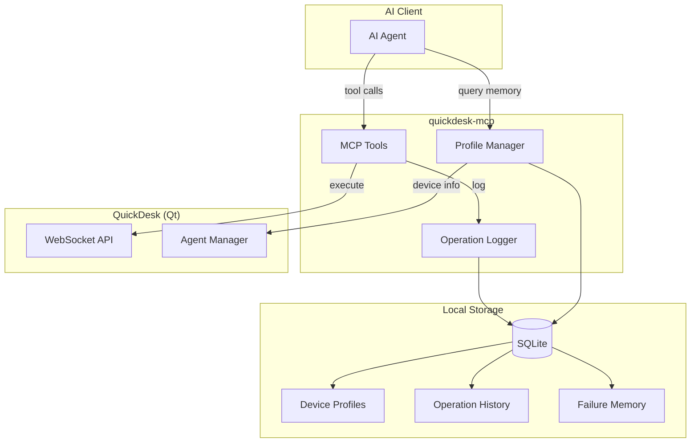
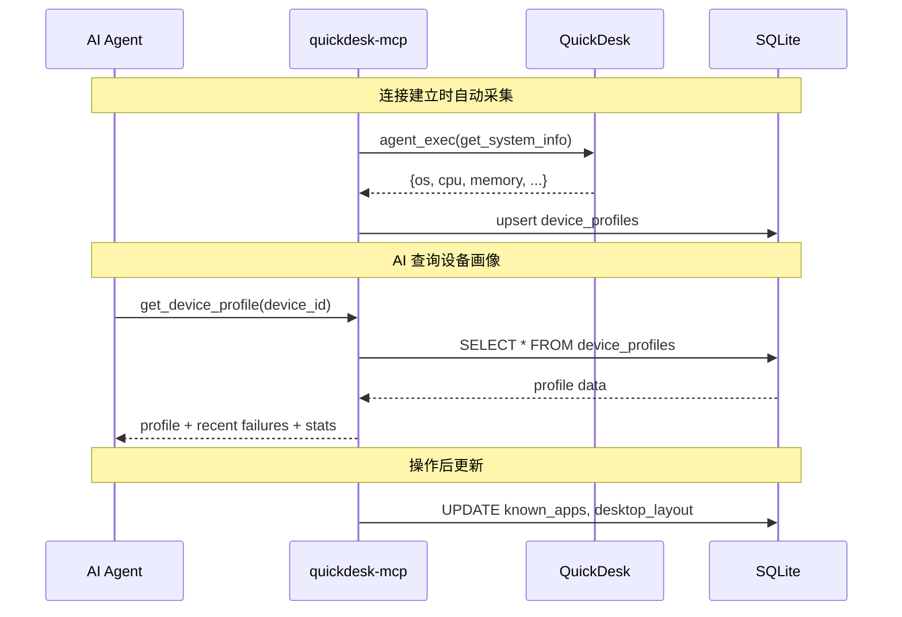
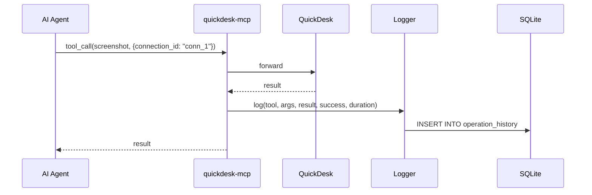

# 设备记忆与历史检索技术方案

## 1. 背景与目标

### 1.1 核心问题

AI 每次连接一台设备都像第一次见到它：不知道常用应用在哪里、不知道系统配置、不知道上次操作的结果。这导致：

1. **重复探索成本高**：每次连接都要先截图看桌面、找应用
2. **无法从失败中学习**：相同的错误反复出现
3. **长期成功率无法提升**：缺乏设备层面的经验积累

### 1.2 目标

- **设备画像**：自动采集和维护设备的软硬件信息、UI 布局习惯
- **操作历史**：记录每次 MCP tool call 的完整上下文
- **失败记忆**：专门记录失败操作及原因，供 AI 参考
- **历史摘要**：生成设备维度的操作摘要

### 1.3 验收标准

- 连接过的设备，第二次操作成功率显著高于第一次
- AI 能引用历史信息辅助决策（如"上次执行这个操作超时了"）
- 用户感知到"AI 越用越懂我的设备"

---

## 2. 整体架构



### 2.1 关键设计决策

| 决策 | 选择 | 理由 |
|------|------|------|
| 存储位置 | quickdesk-mcp 本地 SQLite | 数据属于客户端（AI 使用方），非远程设备 |
| 设备标识 | device_id (9 位) | QuickDesk 全局唯一，稳定不变 |
| 记录粒度 | 每个 tool call | 足够细致，不会过于冗长 |
| 画像更新 | 连接时自动 + 手动触发 | 平衡开销和信息鲜度 |

---

## 3. 详细设计

### 3.1 数据模型

#### 设备画像表 `device_profiles`

```sql
CREATE TABLE device_profiles (
    device_id       TEXT PRIMARY KEY,
    os_name         TEXT,
    os_version      TEXT,
    hostname        TEXT,
    cpu_model       TEXT,
    memory_total_mb INTEGER,
    disk_total_gb   INTEGER,
    resolution      TEXT,
    known_apps      TEXT,        -- JSON array of app names
    desktop_layout  TEXT,        -- JSON: common icon positions
    notes           TEXT,        -- user/AI notes
    first_seen      TEXT,        -- ISO datetime
    last_seen       TEXT,        -- ISO datetime
    connection_count INTEGER DEFAULT 0,
    updated_at      TEXT
);
```

#### 操作历史表 `operation_history`

```sql
CREATE TABLE operation_history (
    id              INTEGER PRIMARY KEY AUTOINCREMENT,
    session_id      TEXT NOT NULL,
    device_id       TEXT NOT NULL,
    timestamp       TEXT NOT NULL,      -- ISO datetime
    tool_name       TEXT NOT NULL,
    arguments       TEXT,               -- JSON
    result_summary  TEXT,               -- truncated result (max 1KB)
    success         INTEGER NOT NULL,   -- 0 or 1
    duration_ms     INTEGER,
    error_message   TEXT,
    context_hash    TEXT                -- screen hash at execution time
);

CREATE INDEX idx_history_device ON operation_history(device_id, timestamp);
CREATE INDEX idx_history_tool ON operation_history(tool_name);
CREATE INDEX idx_history_session ON operation_history(session_id);
```

#### 失败记忆表 `failure_memory`

```sql
CREATE TABLE failure_memory (
    id              INTEGER PRIMARY KEY AUTOINCREMENT,
    device_id       TEXT NOT NULL,
    tool_name       TEXT NOT NULL,
    arguments_pattern TEXT,             -- normalized args (remove variable values)
    error_category  TEXT,               -- timeout / not_found / permission / unknown
    error_message   TEXT,
    occurrence_count INTEGER DEFAULT 1,
    last_occurred   TEXT,               -- ISO datetime
    resolution      TEXT,               -- what fixed it (if known)
    context         TEXT                -- JSON: surrounding state when failure occurred
);

CREATE INDEX idx_failure_device ON failure_memory(device_id);
CREATE INDEX idx_failure_tool ON failure_memory(device_id, tool_name);
```

### 3.2 设备画像采集流程



**自动采集时机**：

1. 首次连接设备时：完整采集
2. 后续连接时：增量更新（last_seen、connection_count）
3. AI 显式调用时：按需更新特定字段

### 3.3 操作日志记录

每次 MCP tool call 执行后自动记录：



**日志策略**：

| 类别 | 记录级别 | 说明 |
|------|---------|------|
| 控制操作 (click, type, hotkey) | 完整记录 | 含参数和结果 |
| 查询操作 (screenshot, get_ui_state) | 摘要记录 | 结果截断到 1KB |
| Agent 工具 (run_command, read_file) | 完整记录 | 含命令和输出摘要 |
| 高频操作 (screenshot) | 采样记录 | 1 秒内多次只记录一条 |

### 3.4 失败记忆

当 tool call 失败时，额外写入 `failure_memory`：

1. **参数归一化**：将具体路径、坐标等变量值替换为占位符，提取操作模式
2. **错误分类**：自动分类为 timeout / not_found / permission / unknown
3. **聚合统计**：相同模式的失败累加 `occurrence_count`
4. **解决方案**：如果后续同类操作成功，记录解决方式

### 3.5 历史摘要

按设备生成操作摘要：

```json
{
  "device_id": "123456789",
  "period": "last_7_days",
  "total_operations": 156,
  "success_rate": 0.92,
  "most_used_tools": [
    { "tool": "screenshot", "count": 45 },
    { "tool": "mouseClick", "count": 32 },
    { "tool": "agent_exec", "count": 28 }
  ],
  "common_failures": [
    {
      "tool": "mouseClick",
      "error": "element not found at expected position",
      "count": 5,
      "resolution": "use find_element before clicking"
    }
  ],
  "sessions": 8,
  "avg_session_duration_min": 12
}
```

---

## 4. 新增 MCP 工具

| Tool | 描述 | 参数 |
|------|------|------|
| `get_device_profile` | 获取设备画像 | `device_id` (from connection_id) |
| `update_device_profile` | 更新设备画像 | `device_id`, `field`, `value` |
| `search_history` | 搜索操作历史 | `device_id`, `tool_name`, `time_range`, `keyword`, `success_only` |
| `get_failure_memory` | 获取设备失败记忆 | `device_id`, `tool_name` (optional) |
| `summarize_session` | 总结当前会话 | `session_id` |
| `device_summary` | 获取设备操作摘要 | `device_id`, `period` |

---

## 5. AI 如何使用记忆

### 5.1 连接时自动注入

AI 连接设备时，MCP server 自动在系统 prompt 或初始响应中包含：

```
Device Profile for 123456789:
- OS: Windows 10 22H2
- Connected 15 times before
- Common apps: Notepad++, Chrome, VS Code
- Recent failures: mouseClick timeout on taskbar (3 times)
  → Resolution: use find_element("Start") instead of fixed coordinates
```

### 5.2 操作前查询

AI 执行高风险操作前，可以查询：

```
> get_failure_memory(device_id="123456789", tool_name="run_command")
Result: Last 3 failures were due to PowerShell execution policy.
  Resolution: Use "cmd /c" instead of "powershell" on this device.
```

---

## 6. 数据管理

### 6.1 存储限制

| 表 | 保留策略 |
|----|---------|
| `device_profiles` | 永久保留 |
| `operation_history` | 最近 30 天或 10000 条 |
| `failure_memory` | 永久保留（失败经验是最有价值的） |

### 6.2 数据库位置

- 路径：`~/.quickdesk/memory/device_memory.db`
- 随 quickdesk-mcp 进程管理
- 可通过设置配置路径

### 6.3 隐私

- 所有数据存储在本地
- 不上传到任何服务器
- 用户可随时删除特定设备的所有记忆

---

## 7. 实现计划

### 阶段一：基础设施 + 设备画像（5 天）

| 天 | 任务 |
|----|------|
| 1 | SQLite schema 设计 + 数据库初始化 |
| 2-3 | 设备画像自动采集 + `get_device_profile` / `update_device_profile` |
| 4-5 | 连接时自动采集流程 + 测试 |

### 阶段二：操作历史（5 天）

| 天 | 任务 |
|----|------|
| 1-2 | Operation Logger：拦截 + 记录 tool calls |
| 3 | `search_history` 工具实现 |
| 4 | `summarize_session` / `device_summary` |
| 5 | 数据清理策略 + 测试 |

### 阶段三：失败记忆（5 天）

| 天 | 任务 |
|----|------|
| 1-2 | 失败检测 + 参数归一化 + 错误分类 |
| 3 | `get_failure_memory` 工具实现 |
| 4 | 解决方案自动记录 |
| 5 | 端到端测试 + 文档 |

---

## 8. 风险与缓解

| 风险 | 等级 | 缓解措施 |
|------|------|---------|
| 数据库增长过快 | 中 | 设置保留策略，高频操作采样记录 |
| 设备画像信息过时 | 低 | 每次连接增量更新 |
| 失败模式分类不准 | 中 | 初期简单分类，后续可引入 AI 辅助分类 |
| 多 AI 客户端并发写入 | 低 | SQLite WAL 模式支持并发读写 |
